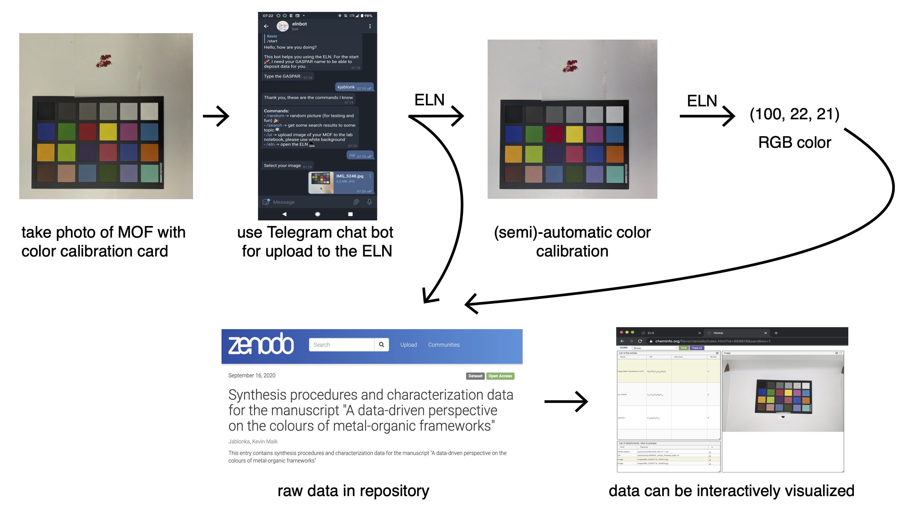

# elnbot

Prototype pf a telegram bot to conveniently add data to the [ELN](eln.epfl.ch).
We plan to couple it also with some online analysis (e.g. image recognition) or integrate it with lab automation. The idea is to enable a workflow as shown below

Details of this approach are described in our [preprint](https://chemrxiv.org/articles/preprint/A_Data-Driven_Perspective_on_the_Colours_of_Metal-Organic_Frameworks/13033217).

The bot is deployed at t.me/epfl_eln_bot.

## How to run it

For simple testing without upload on EPFL internal servers, one can host it on [glitch](https://glitch.com/).
If the upload to the samba share for images is needed, it is important to have the corresponding share mounted in the filesystem of the server which is running the bot.

Environmental variables that need to be set:

- `TELEGRAM_TOKEN`: Telegram token for the bot.
- `IMAGE_STORAGE_PATH`: Path at which the samba share for image upload is mounted.

You can declare those in a `.env` file.
